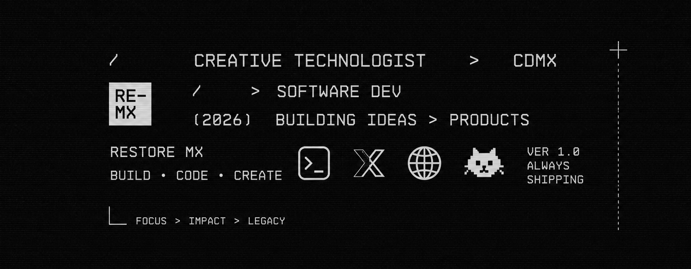
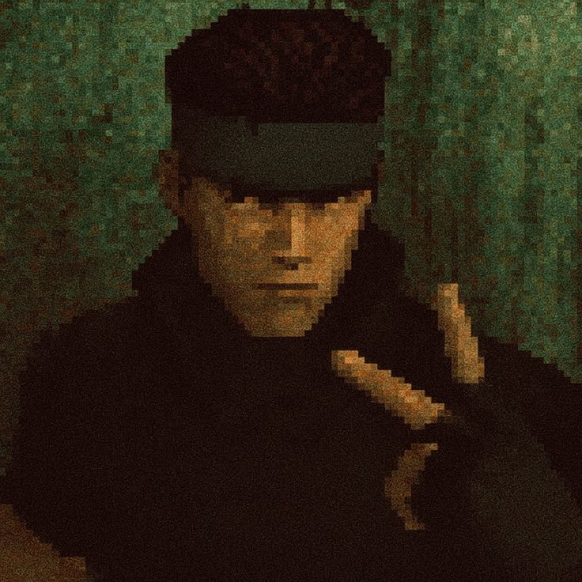

 

<h2 align="center"> <em>About me</em> </h2>

 

  Hello There! <em><b>I'm Cory</b></em>, a creative technologist working at the intersection of AI, video and real-time media. I build generative pipelines for image, video and voice, plus the automation that glues it all together.

 

   <em><b> Generative AI — image, video &amp; voice pipelines </b></em> 
   <em><b> Real-time media — streaming, WebRTC, GPU-accelerated inference </b></em> 
   <em><b> If it can be scripted, it gets scripted </b></em> 
   <em><b> Most of my work lives in private repos (for now) </b></em> 

 
 

<h2 align="center"> <em>Technologies</em> </h2>

  
  
  
  
  
  
  
  
  
  
  
  
  
  
  
  
  
  
  

 

<h2 align="center"> <em>Statistics</em> </h2>

  
  
    
  

